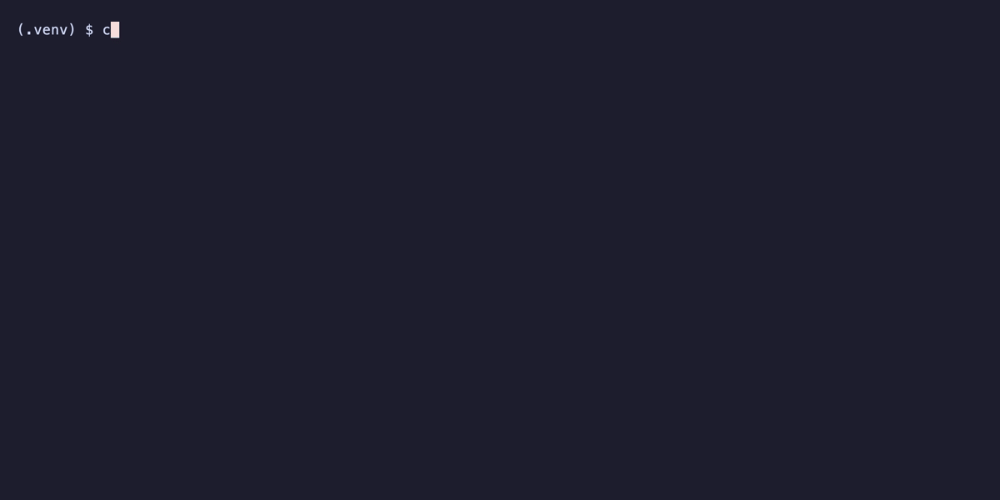
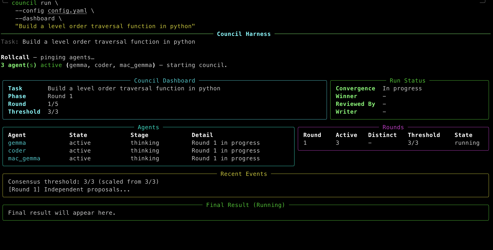
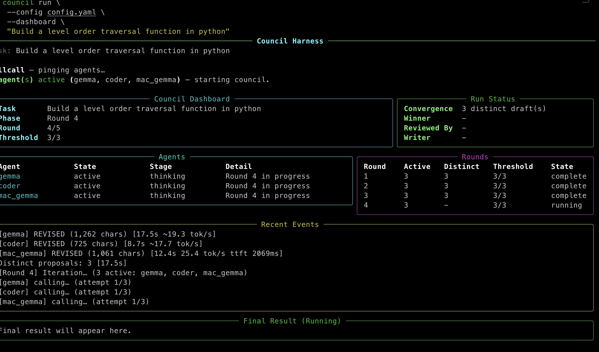
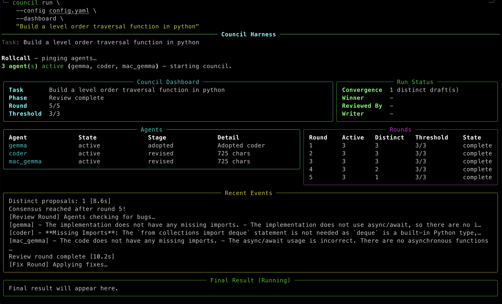
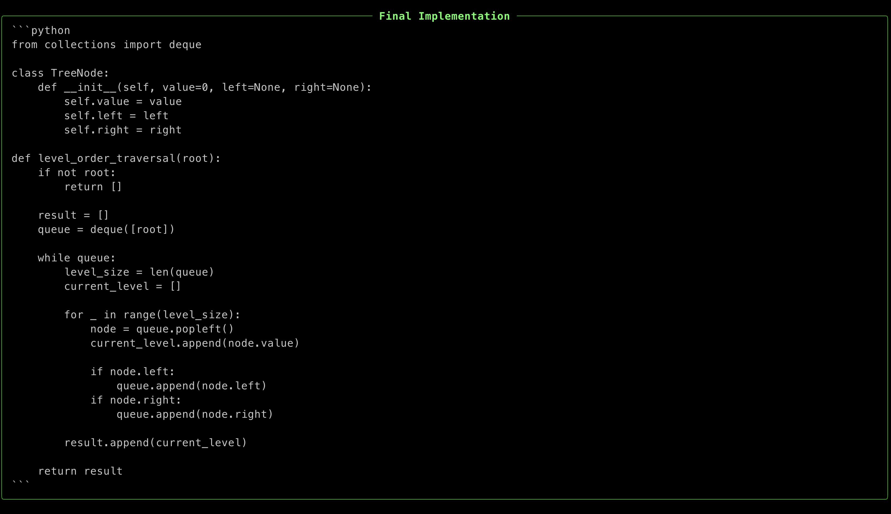

# Council Harness

A CLI tool that sends a coding task to a council of LLM agents — local models **and** subscription-based CLI agents (Claude Code, Codex) — runs an iterative discussion loop until they converge on a single agreed implementation, then optionally hands the result to a designated writer agent for clean final output.

> **Note on scope.** This is an experiment in multi-agent code generation. The council converges and produces working drafts, but multi-agent output reliably benefits from a short human review pass — treat the result as a strong starting point, not a finished artifact. See [FINDINGS.md](FINDINGS.md) for honest, observational notes on where local models and the council structure hold up and where they don't.

## Demo

A full run — agents propose in parallel, debate over rounds, and converge on one implementation:


**Rollcall** pings every configured agent first, so the council runs with whoever responded:



### Walkthrough

| | |
|---|---|
| **1. Round 1** — every active agent thinks independently |  |
| **2. Discussion** — agents revise or adopt each other's drafts |  |
| **3. Convergence + review** — the council aligns on one draft, then agents bug-hunt and apply fixes |  |
| **4. Final implementation** — the agreed code |  |

## What it does

1. **Rollcall** — pings every configured agent and records who responds. The council runs with whoever showed up; missing agents are printed clearly before round 1.
2. **Round 1** — all active agents receive the task independently and propose an implementation (in parallel).
3. **Rounds 2–N** — each agent sees all current proposals and must respond in a structured format: either revise their own draft or adopt another agent's. Runs until consensus or the round limit.
4. **Convergence** — after each round, if enough agents share the same draft (≥ `consensus_threshold`, scaled to active count), the loop stops early.
5. **Fallbacks** — if the round limit is hit, the proposal with the most agents aligned on it wins. If it's a true tie, the CLI pauses and lets you pick a proposal — or restart the run from round 1.
6. **Review/fix pass** — if `review_round: true` (default, holistic mode), active agents do a bug-finding pass and the winning agent applies fixes before final output.
7. **Writer pass** — if a `writer:` agent is configured, the agreed draft is transcribed to clean final output (or, for a write-enabled CLI writer, written straight to disk).

## Installation

Requires Python 3.11+.

```bash
python3 -m venv .venv
source .venv/bin/activate   # Windows: .venv\Scripts\activate
pip install -e .

# create your local config from the example, then edit it
cp config.example.yaml config.yaml
```

Subscription CLI agents are optional. To use them, install and log in to the
respective CLI first: [`claude`](https://claude.com/claude-code) (`claude_cli`)
and/or [`codex`](https://developers.openai.com/codex/cli) (`codex_cli`). They
authenticate via your existing subscription login — no API key.

## Usage

```bash
council run "implement a token-bucket rate limiter for a FastAPI app"

# custom config file
council run "implement a binary search tree" --config my-council.yaml

# write multi-file output to a directory
council run "build a small CLI package with tests" --output-dir ./out

# run the contract_parts pipeline (design → assign → implement → review → merge)
council run "build a JWT auth module" --mode contract_parts --output-dir ./out

# live dashboard
council run "implement a JWT auth middleware" --dashboard

# onboard a new agent
council agent add --id llama --model llama3 --url http://localhost:11434 --type ollama

# all options
council --help
```

Progress is printed round-by-round as it runs. The final implementation is shown in a panel at the end.

## Configuration

All behaviour is driven by `config.yaml` in the working directory (override with `--config`). See **`config.example.yaml`** for a fully commented template. `config.yaml` is gitignored — keep your real endpoints and tokens out of version control.

```yaml
agents:
  - id: local              # unique identifier used in logs and prompts
    type: ollama           # local Ollama server (default)
    model: qwen2.5-coder:7b
    url: http://localhost:11434

  - id: gateway            # any OpenAI-compatible endpoint (Open WebUI, vLLM, ...)
    type: openai
    model: your-model:latest
    url: http://your-gateway.local:8080/openai
    api_key_env: COUNCIL_GATEWAY_TOKEN   # never hardcode tokens — use an env var

  - id: claude             # subscription CLI agent (no API key)
    type: claude_cli
    model: sonnet          # alias (sonnet/opus) or full id; optional

  - id: codex              # subscription CLI agent (no API key)
    type: codex_cli        # omit `model` on a ChatGPT subscription account

rounds:
  max: 5                 # hard cap on discussion rounds
  consensus_threshold: 2 # how many agents must align on the same draft to stop early
                         # scaled proportionally if fewer agents respond to rollcall

review_round: true       # optional; post-consensus review/fix pass (holistic mode)

writer:                  # optional; transcribes the agreed draft to final output
  id: writer
  type: ollama
  model: qwen2.5-coder:7b
  url: http://localhost:11434
```

### Agent types

| `type`       | Backend                          | Auth                                    |
|--------------|----------------------------------|-----------------------------------------|
| `ollama`     | `POST {url}/api/generate`        | none                                    |
| `openai`     | `POST {url}/v1/chat/completions` | Bearer token via `api_key_env`          |
| `claude_cli` | `claude -p` subprocess           | Claude subscription login (no API key)  |
| `codex_cli`  | `codex exec` subprocess          | ChatGPT subscription login (no API key) |

CLI agents run **generation-only and sandboxed** as council members (read-only,
in a throwaway working directory). They can only write files when configured as
a write-enabled writer (see below).

### Secrets

Never put API keys in `config.yaml`. Use `api_key_env: SOME_VAR` and export the
token in your shell (`export SOME_VAR=...`). `config.yaml` is gitignored;
`config.example.yaml` ships with placeholders only.

### Consensus threshold scaling

`consensus_threshold` is defined relative to the number of configured agents. At runtime it scales to whoever actually responded to rollcall:

```
effective = ceil(active_count × threshold / configured_count)
```

Example: threshold 2-of-3 configured, only 2 respond → effective threshold becomes 2-of-2.

### Writer agent

When `writer:` is present, it receives the agreed draft with a strict transcription prompt: reproduce it exactly, no changes, no preamble. A plain (`ollama`/`openai`) writer returns text and the harness writes the files.

A **write-enabled CLI writer** writes the files itself. Add `can_write: true` and run with `--output-dir`; the writer creates the files directly (`claude_cli` via `--permission-mode acceptEdits`, `codex_cli` via `-s workspace-write`). If it produces no files, the harness falls back to parsing the council draft. Give CLI writers a generous `timeout`.

```yaml
writer:
  id: claude
  type: claude_cli
  model: sonnet
  can_write: true
  timeout: 300
```

### Dashboard

Pass `--dashboard` for an opt-in live terminal dashboard: agent reachability and stage, round number and distinct-draft count, effective convergence threshold, review/writer activity, and (in `contract_parts`) reassigned parts and fix retries. The dashboard is additive — normal CLI output is unchanged when omitted.

### Agent onboarding

Manage council members without hand-editing YAML:

```bash
council agent list
council agent add --id coder2 --model qwen2.5-coder --url http://localhost:11434 --type ollama
council agent update coder2 --api-key-env COUNCIL_GATEWAY_TOKEN --type openai
council agent update coder2 --unset api_key --unset timeout
```

These rewrite `config.yaml` and leave a `config.yaml.bak` backup beside it.

## Modes

Set the mode with `--mode` or in `config.yaml` (`mode: holistic` | `contract_parts`).

### `holistic` (default)

All agents receive the full task, propose independent implementations, and converge over multiple rounds until they agree. Best for single-file or small multi-file tasks where the whole solution fits in one model context.

### `contract_parts`

Designed for larger, multi-file tasks. Agents first agree on an architecture, then divide the work and implement independently. Phases printed during a run:

```
[Architecture]   agents independently propose module breakdown and interfaces
[Contract]       council converges on one architecture via REVISE/ADOPT rounds
[Assignment]     harness assigns file ownership from the agreed OWNERSHIP block
[Implementation] each agent implements only their owned files (parallel)
[Cross-Review]   each agent reviews a different agent's files against the contract
[Fix]            each implementer applies reviewer feedback to their own files
[Merge]          harness combines all parts deterministically by ownership
[Validation]     parses every merged file (syntax) and checks contract interfaces exist
[Integration]    council checks the merged whole for drift, missing glue, test gaps
[Result]         final output
```

File ownership and emitted paths are matched tolerantly (exact path, then unambiguous basename), and code fences are stripped per file, so prefix drift and ` ```python ` wrappers don't corrupt the merge. The **Validation** phase is advisory — it reports syntax errors and missing interfaces without aborting, surfacing issues the cross-review may have missed.

**Contract format** — what the council agrees on before any code is written:

```
GOAL
Implement JWT authentication for a FastAPI service.

MODULES
- auth/token.py: token creation, parsing, and validation
- auth/routes.py: login and refresh HTTP endpoints

INTERFACES
- validate_token(token: str) -> Claims: parse and verify a JWT, raise on failure
- login(username: str, password: str) -> AuthResult: authenticate and return tokens

RULES
- token validation lives only in auth/token.py

OWNERSHIP
- llama: auth/token.py
- mistral: auth/routes.py
```

**Use `contract_parts` when:** the task produces 3+ files with cross-file boundaries, you have 2+ agents, and you want reviewers checking architectural rules — not just correctness. **Stick with `holistic`** for single-file tasks, one agent, or fast iteration.

> CLI agents are slower as reviewers (the cross-review prompt carries the full contract plus a peer's implementation). If a `codex_cli`/`claude_cli` agent is in the council, give it a generous `timeout` so its review doesn't time out and skip the fix phase.

## Iteration format

In rounds 2–N each agent must respond in this exact structure:

```
ACTION: revise
DRAFT: <full implementation>
```

or

```
ACTION: adopt
TARGET: <agent_id>
```

The harness retries up to 3 times if the format is not followed. On total failure the agent keeps its current draft and the round continues.

## Output

On consensus or majority win:

```
Status : CONSENSUS   (or MAJORITY)
Winner : coder
Rounds : 3
╭─ Final Implementation ──────────────────────────────────╮
│  <implementation>                                        │
╰──────────────────────────────────────────────────────────╯
```

With `--output-dir`, multi-file results are written as `### FILE:` blocks; a single-file result without markers is written to `output.txt`. A `council.log` transcript is always written into the output dir, and `contract_parts` runs also write artifacts to `.council-harness/` (contract, per-agent drafts and reviews, merged output, validation report).

On a true tie (rare): the remaining distinct proposals are printed and you pick one by number — or enter `r` to restart from round 1.

## Development

```bash
pip install -e ".[dev]"
pytest
```

## Notes

- If only one agent responds to rollcall, round 1 is the final result with no discussion.
- Multiple models sharing one GPU will queue rather than run truly concurrently — round latency reflects that.
- Self-adoption (`ACTION: adopt` targeting the same agent) is silently rejected and treated as a parse failure (triggers retry).
